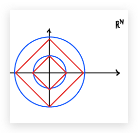
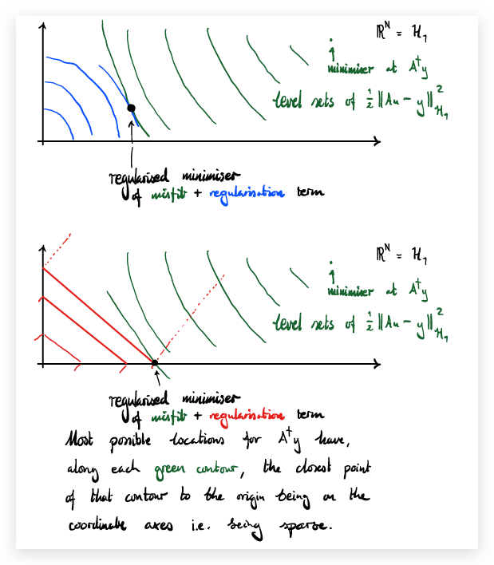

## Week 9

* Heuristics for choice of regularisation parameter
* $\ell^1$ regularisation as a sparsity-promoting regularisation
* Total variation regularisation for edge-preserving image reconstruction — a cautionary tale
* The Bayesian approach to inverse problems

---

## Ways to set the regularisation parameter

We already discussed the situation of **a priori** regularisation: we set $\alpha$ to be a function of the noise level $\delta$ but **not** of the observed data $y$. If one also has a source condition for the signal $u$, then one can prove upper bounds for the reconstruction error — as in the extra handout from last week.

An **a posteriori** choice of $\alpha$ allows it to be a function of both $\delta$ and $y$. The danger is that we may overfit to the specific instance of $y$ that we have seen; the optimal reconstruction may do well for $y$ but poorly for other $y'$. In this situation, we typically start with a large $\alpha$ and then reduce it until the residual is approximately $\delta$. This is Morozov's discrepancy principle.

Finally, heuristic strategies allow $\alpha$ to depend only on $y$ (not on $\delta$). Here it can be shown that a heuristic choice of $\alpha$ such that $u_\alpha \to u$ as $\alpha \to 0$ must have $\mathrm{ran}(A)$ being closed, which is the "boring" case that $A^\dagger$ is bounded and $A$ has finite rank. (This is Bakushinskii's veto.) A straightforward heuristic strategy to use when we have access to many instances of $y$ is to split the data set into a training set and a validation set.

---

## L1 regularisation and sparsity

We're comparing the minimisers of

$$\frac{1}{2}\|Au-y\|^2+\frac{\alpha}{2}\|u\|^2$$

with minimisers of

$$\frac{1}{2}\|Au-y\|^2+\alpha\|u\|_1$$

Let's consider $u \in \mathbb{R}^N$ with $N$ finite, and try to understand why minimisers of the second ($\ell^1$) problem are sparse, with most $u_n=0$, whereas minimisers of the first ($\ell^2$/ridge regression/Tikhonov) problem have no special structure.

First observe that the balls of the $\ell^2$ and $\ell^1$ norms have different shapes:

This matters because minimising the regularised misfit is the same thing as finding the "closest" point of some level set of the misfit to the origin, where "closest" is measured according to the $\ell^2$ or $\ell^1$ norm as appropriate.

Most possible locations for $A^\dagger y$ have, along each green contour, the closest point of that contour to the origin being on the coordinate axes i.e. being sparse.

To what extent is this heuristic rigorously true when $H_1$ is genuinely infinite-dimensional? A related question is whether we can do similar tricks for edge-detection, by imposing a penalty like the $\ell^1$ norm on the derivative of $u$.

---

## TV regularisation and edge-preserving image reconstruction

Let's consider a 1-dimensional "image" / time series as a function $u:[a,b]\to\mathbb{R}$. If $u$ is differentiable, then we define its total variation by

$$\|u\|_{\mathrm{TV}} := \int_a^b |u'(t)| \, dt$$

**Just a seminorm** because $\|u\|_{\mathrm{TV}}=0$ for any constant $u$.

The TV seminorm is a good candidate for a regularisation that, like the $\ell^1$ norm of a vector, will sparsify $u'$, i.e. give the minimiser a few well-localised jumps/edges.

Lemna & Siltanen (2005) showed that there is **no** choice of $\alpha(N)$ such that the limit exists and is useful — you always end up with some bad feature, e.g. smooth (non-edge) limiting reconstructions, the limit being $0$ regardless of $y$, or the posterior mean failing to exist.

This fundamental mathematical obstacle stimulated the study of (optimisation-based and Bayesian) inverse problems on function spaces directly, not just each finite-dimensional subspace individually.

---

## The Bayesian approach to inverse problems

The challenge is the same as always: we want to recover an unknown $u$ from data $y$. The Bayesian worldview is:

1. Treat the unknown and the data as random variables: $u$ (with values in $\mathcal{U}$) and $y$ (with values in $\mathcal{Y}$).

2. The beliefs you have about the unknown before seeing the data are encoded in the prior distribution $\mu_0$ of $u$ on $\mathcal{U}$.

3. The (ideal) relationship between the unknown and the data is encoded in the likelihood model.

4. The prior and the likelihood together determine the joint distribution $\mu_{(u,y)}$ of $(u,y)$ on $\mathcal{U} \times \mathcal{Y}$.

5. The Bayesian solution to the inverse problem is the conditional distribution $\mu_{u \mid y=y}$ on $\mathcal{U}$. Bayesians call this the posterior distribution.

**NB** The posterior distribution is defined to be the result of conditioning the joint distribution onto the slice "$y=y$"; it is a "happy accident" that we can sometimes realise it by reweighting the prior, as Bayes' rule claims.

---

## Linear Gaussian Bayesian inverse problems

Take $\mathcal{U}$ to be a Hilbert space $H$, let $\mathcal{Y}=\mathbb{R}^J$ for some $J \in \mathbb{N}$, and suppose that observations $y$ are made according to the linear model

$$y = Au + \eta$$

where $\eta \sim \mathcal{N}(0,\Gamma)$ in $\mathcal{Y}=\mathbb{R}^J$, with $\Gamma \in \mathbb{R}^{J \times J}$ SPD, independent of $u$.

This measurement model says that the conditional distribution of $y$ given $u$ is Gaussian with mean $Au$ and covariance $\Gamma$, i.e. it has PDF proportional to $\exp(-\Phi(u;y))$, where the potential is

$$\Phi(u;y) = \frac{1}{2} \|\Gamma^{-1/2}(Au-y)\|^2$$

Suppose that a prior $\mu_0$ for $u$ is specified. In the specific case that $\mu_0 = \mathcal{N}(m_0,C_0)$ is Gaussian, the joint distribution is again Gaussian, and the usual formula for conditioning Gaussians applies.

The posterior is $\mu_{u \mid y=y} = \mathcal{N}(m^y,C^y)$ where

$$m^y = m_0 + C_0 A^* (A C_0 A^* + \Gamma)^{-1} (y - A m_0)$$

$$C^y = C_0 - C_0 A^* (A C_0 A^* + \Gamma)^{-1} A C_0$$

(the Kalman update formula again).

Interestingly, if we compare the posterior to the prior, we notice that the posterior has a density with respect to the prior:

$$\frac{d\mu_{u \mid y=y}}{d\mu_0}(u) = \frac{\exp(-\Phi(u;y))}{Z(y)}$$

with normalising constant

$$Z(y) = \int_{\mathcal{U}} \exp(-\Phi(u;y)) \, \mu_0(du)$$

This is the more robust formulation of Bayes' rule: not "posterior = likelihood × prior" but "the density of the posterior w.r.t. the prior = the likelihood".

---

## Generalised Bayes rule

**Theorem** Let $\mathcal{U}=H$ be a Hilbert space and $\mathcal{Y}=\mathbb{R}^J$. Let $u \sim \mu_0$ and suppose that the conditional distribution of $y$ given $u$ has PDF $\rho_{y \mid u}$ on $\mathbb{R}^J$.

Assume that $\rho_y$ is everywhere positive, where

$$\rho_y(y) := \int_{\mathcal{U}} \rho_{y \mid u}(y) \, \mu_0(du)$$

Then the posterior distribution $\mu_{u \mid y=y}$ exists and has a density w.r.t. $\mu_0$ given by Bayes rule:

$$\frac{d\mu_{u \mid y=y}}{d\mu_0}(u) = \frac{\rho_{y \mid u}(y)}{\rho_y(y)}$$

**Proof** The proof is mostly just checking that this satisfies the reconstruction law. Starting from the RHS of the reconstruction law and applying Fubini gives the result. $\square$